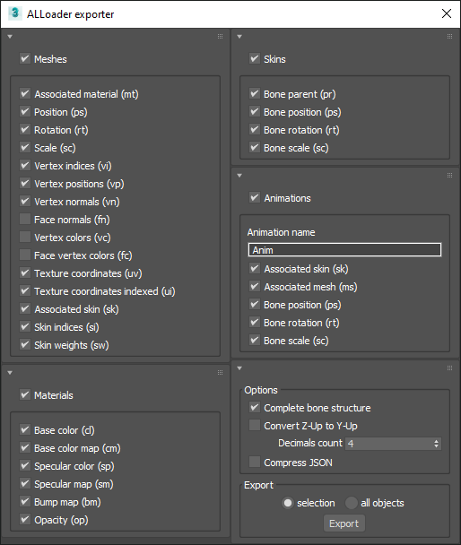

# ALLoader  
ALLoader is an Autodesk 3dsMax exporter (MaxScript) to JSON, and a WebGL Three.js loader (Javascript) which supports skinned, rigged and animated meshes.

### Live demos
[http://antlafarge.github.io/ALLoader/](http://antlafarge.github.io/ALLoader/)

## Versions
- 3dsMax 2025 : Planned
- 3dsMax 2024 : Planned
- 3dsMax 2023 : Planned
- [3ds Max 2022](https://github.com/antlafarge/ALLoader/releases/tag/3dsmax2022) : Pre-released 
- [3ds Max 2015](https://github.com/antlafarge/ALLoader/releases/tag/3dsmax2015) : Released 

## Exporter preview
3ds Max 2022 exporter preview :  

## How to export meshes and animations
- Open 3ds Max and your scene *(all meshes will be exported)*
- Open the **Utilities** tab in the right lateral tool bar
- Clic on **MAXScript** button
- Clic on **Run Script** button
- Go to the **exporters** folder of ALLoader
- Run the **exporter.ms** script
- Follow the instructions

## Exported data
- Meshes
    - Name (JSON field)
    - Associated material (mt)
    - Position (ps)
    - Rotation (rt)
    - Scale (sc)
    - Vertex indices (vi)
    - Vertex positions (vp)
    - Vertex normals (vn)
    - Face normals (fn)
    - Vertex colors (vc)
    - Face vertex colors (fc)
    - Texture coordinates UV indices (ui)
    - Texture coordinates UV (uv)
    - Skin indices (si)
    - Skin weights (sw)
- Materials
    - Name (JSON field)
    - Color (cl)
    - Color map (cm)
    - Specular (sp)
    - Transparency (op)
- Skeletons
    - Name (JSON field)
    - Parent (pr)
    - Position (ps)
    - Rotation (rt)
    - Scale (sc)
- Animations
    - Associated skeleton (sk)
    - Associated mesh (ms)
    - Bone name (bn)
    - Hierarchy (hr)
        - Time (tm)
        - Position (ps)
        - Rotation (rt)
        - Scale (sc)

## 3ds Max elements supported
- Axis conversion (Z-up to Y-up)
- Meshes
- Materials (Physical material, Multi/Sub-Object material, TwoSided material)
- Material IDs
- Color map (texture)
- Wire
- Opacity
- Timeline playback speed
- Skin modifier (bones)
- Vertex paint modifier (Vertex color)

## FAQ
Q. Some objects in the scene are not well placed?  
A. Add a reset XForm on these objects and export.  

Q. I can't export a biped skeleton from 3DSMax?  
A. Export your scene using the FBX format, close your scene and open the FBX file. This action will convert the biped to a standart skeleton (tree of bones). You can now export your scene using the exporter.  

_You can share feedback or discuss the project in the [discussion tab](https://github.com/antlafarge/ALLoader/discussions)._  

## Todo
- Check gordon skeleton transforms
- Check every types of objects are well exported (EditPoly, EditMesh...)
- 3dsMax biped
